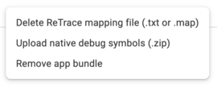

# Fix warnings on Google Play Console built

# Contents

### #Warning: This App Bundle contains native code, and you've not uploaded debug symbols. We recommend you upload a symbol file to make your crashes and ANRs easier to analyze and debug.

1. Go to [YOUR_PROJECT]\build\app\intermediates\merged_native_libs\release\out\lib
   > For some the path might be [YOUR_PROJECT]\android\app\build\... depends on what programming language or framework you are using.
2. Zip (**Must be ZIP file**) all the directories in this location (include `arm64-v8a`, `armeabi-v7a`, `x86_64`, `x86`).
3. Upload `symbols.zip` to Google Play Console

- Open Google Play Console.
- Go to your app > Release > **App Bundle Explorer**.
- In your uploaded AAB version is always having options like this, then select **Upload native debug symbols (.zip)**
  
