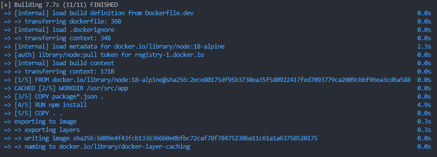
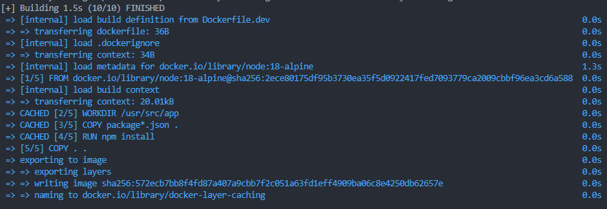

## Docker Layer Caching

When building an image, Docker steps through the instructions (command line) in your Dockerfile. Each instruction creates a new image layer.

The next time Docker image is rebuilt. As each instruction is examined, if Docker sees a layer that has not changed from previous builds, it will reuse that existing image layer in its cache, rather than creating a new (duplicate) image.

Docker uses a layer cache to optimize and speed up the process of building Docker images.

⚠️ Docker Layer Caching mainly works on the instructions such as RUN, COPY and ADD.

## Use `COPY` particularly instead of `COPY . .`

Sometimes, we need to modify code in src without affecting to dependencies (package.json is much less change, there's not always installing additional package). Thus, when using `COPY . .`, it copies the entire outside source code into container. As a result, if there is any change in the source code, all steps in Dockerfile have to be rerun.

So, we should only copy files package.json and package-lock.json
(or yarn.lock) into container to run `npm install` for `node_modules` (Mostly, we waste time in this instruction `RUN npm install`)

Let's use `COPY` like this following:

```bash
FROM node:18-alpine

WORKDIR /usr/src/app

# Copy original files to WORKDIR
COPY package*.json .

# Install dependencies
RUN npm install

# Copy original source code to WORKDIR
COPY . .

# Use user "node", DO NOT USE user "root", default is "root"
USER node

EXPOSE 8000
```

### Build test

- Before:



- After:



## Run local

```bash
# Build container and run
$ docker-compose -f docker-compose.dev.yml up
```

## Reference

https://viblo.asia/p/tang-toc-do-build-va-toi-gian-docker-image-Eb85oODB52G

https://docs.docker.com/develop/develop-images/dockerfile_best-practices/

https://docs.semaphoreci.com/ci-cd-environment/docker-layer-caching/
