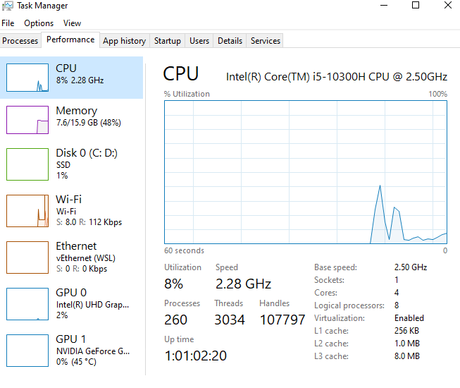

Because libuv's threadpool has a fixed size, it means that if for whatever reason any of these APIs takes a long time, other (seemingly unrelated) APIs that run in libuv's threadpool will experience degraded performance. In order to mitigate this issue, one potential solution is to increase the size of libuv's threadpool by setting the 'UV_THREADPOOL_SIZE' environment variable to a value greater than 4 (its current default value)

We should use threadpool equivalent of our processor for reaching maximum performance in our application

```bash
# Configuration
const OS = require("os");

// my computer system has 8 CPUs (~ logical processor)
// OS.cpus().length = 8
process.env.UV_THREADPOOL_SIZE = OS.cpus().length

```


