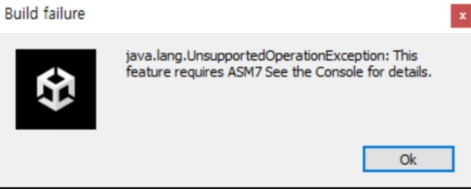

## Getting Started

1. Download the Mobile Ads Unity plugin

- Get plugin from this link: https://developers.google.com/admob/unity/quick-start

2. Import the Mobile Ads Unity plugin

- Open your project in the Unity editor. **Select Assets > Import Package > Custom Package** and find the **GoogleMobileAdsPlugin.unitypackage** file you downloaded.

3. Include the Mobile Ads SDK

- In the Unity editor, select **Assets > External Dependency Manager > Android Resolver > Resolve**. The Unity External Dependency Manager library will copy the declared dependencies into the **Assets/Plugins/Android** directory of your Unity app.

4. Set your AdMob app ID
   **Google Mobile Ad App Id:** `ca-app-pub-3940256099942544~3347511713` (only ad test)
   > ⚠️ The build is getting error if you do not set Google Mobile Ad App Id

- In the Unity editor, select **Assets > Google Mobile Ads > Settings**
- Enter your Android and iOS AdMob app ID in each field.

## Display admob on real app

### Android

Sometimes, we cannot display admob after running build version on Android
 

#### **java.lang.unsupportedoperationexception**

<kbd></kbd>

 

Try following the below steps:

- Delete folder: **<PROJECT_FOLDER>\Library\Bee\Android**
- **Edit > Project Settings > Player >**
  - **Other Settings > Identification >**
    - Increase the **Minimum API Level** to **Android 7.0**
    - **Target API Level** to **Automatic (highest installed)**
  - **Publishing Settings > Build**
    - Checkbox **Custom Main Gradle Template**
    - Checkbox **Custom Gradle Properties Template**
- **Assets > External Dependency Manager > Android Resolver > Force Resolve**
- Build again

## Usage

- (old)
- (new)
