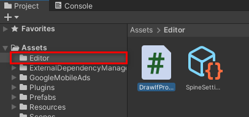

## Usage

1. Put `DrawIfPropertyDrawer.cs` to folder `Editor`
   <br>
   <kbd></kbd>
2. Add custom attribute above [SerializeField]

```js
[DrawIf("scaleType", new object[] { ScaleType.Loop, ScaleType.NoLoop })] <<====
[SerializeField] private float initialScale = 1f;
```

### Reference: https://forum.unity.com/threads/draw-a-field-only-if-a-condition-is-met.448855/
