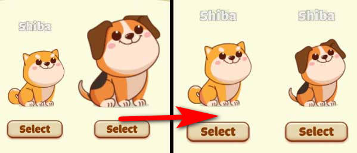
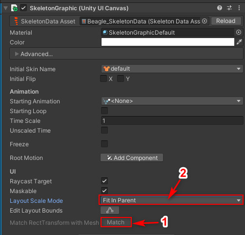

## How to fit skeleton with rectTransform (only Canvas UI)

In SkeletonGraphic Component, click button **Match** at `Match RectTransform with Mesh`, then select any options at `Layout Scale Mode`, Skeleton will be fit with its Width and Height.
 
<kbd></kbd>
 
<kbd></kbd>
